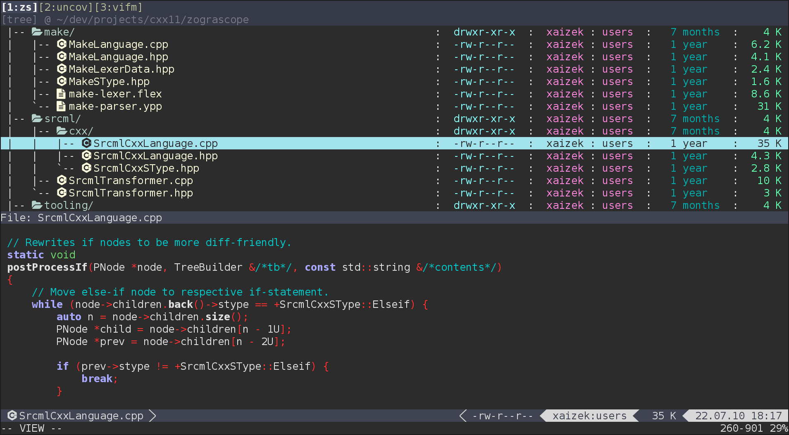
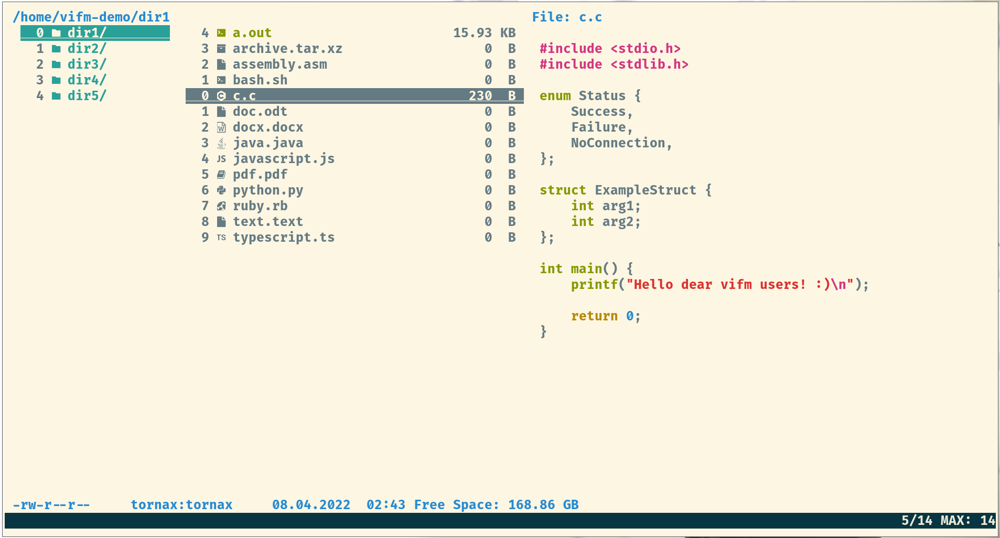

# Vifm – Vim-like file manager

[![][AA]][A]  [![][FF]][F]  [![][UU]][U]  [![][SS]][S]

_Latest release is 0.13.  This file last updated on 04 April 2023._

## Brief Description ##

**Vifm** is a curses based Vim-like file manager extended with some useful
ideas from mutt.  If you use Vim, Vifm gives you complete keyboard control
over your files without having to learn a new set of commands.  It goes not
just about Vim-like keybindings, but also about modes, options, registers,
commands and other things you might already like in Vim.

Just like Vim, Vifm tries to adhere to the Unix philosophy.  So instead of
working solutions which are set in stone user is provided with a set of
means for customization of Vifm to one's likings.  Though builtin
functionality should be enough for most of use cases.

## Resources and Contacts ##

| Usage     | Link                     |
| :-------: | :----:                   |
| Website   | https://vifm.info/       |
| Wiki      | https://wiki.vifm.info/  |
| Q & A     | https://q2a.vifm.info/   |

### Communication ###

| Reason                                           | Channel                                                         |
| :-------:                                        | :------:                                                        |
| Bugs & Feature Requests                          | [GitHub][bugs-gh], [SourceForge][bugs-sf] or via [email][email] |
| Preferred place for asking usage questions       | Posting on the [Q&A][q2a] site                                  |
| Read-only and very low traffic news mailing list | [vifm-announce][list]                                           |

### Other resources ###

| Usage                     | Where to find                                                           |
| :---:                     | :---:                                                                   |
| Repositories              | [GitHub][repo-gh] and [SourceForge][repo-sf]                            |
| Vim Plugin                | [Repository][vim-plugin]                                                |
| Colorschemes (maintained) | [Repository][colors] and [colorscheme-previews][colorscheme-preview]    |
| Devicons/favicons         | [[1]][devicons-1], [[2]][devicons-2]                                    |
| vifmimg (image preview)   | [Repository][vifmimg] (using [überzug][ueberzug] to display the images) |
| sixel image preview       | [Repository][sixel-preview] (for [Sixel][wiki-sixel]-capable terminals) |

## Screenshots ##

## Getting Started ##

A good idea for quick start might be skimming over [cheatsheet][cheatsheet] for
the main mode (that is Normal mode), reading some sections on basic usage on
[the wiki][wiki-manual] and looking at sample configuration file (run
`:edit $MYVIFMC`).

## License ##

GNU General Public License, version 2 or later.

[q2a]: https://q2a.vifm.info/
[email]: mailto:xaizek@posteo.net
[list]: https://lists.sourceforge.net/lists/listinfo/vifm-announce
[vim-plugin]: https://github.com/vifm/vifm.vim
[colors]: https://github.com/vifm/vifm-colors
[colorscheme-preview]: https://vifm.info/colorschemes.shtml
[devicons-1]: https://github.com/cirala/vifm_devicons
[devicons-2]: https://github.com/yanzhang0219/dotfiles/tree/master/.config/vifm
[vifmimg]: https://github.com/cirala/vifmimg
[sixel-preview]: https://github.com/eylles/vifm-sixel-preview
[ueberzug]: https://github.com/seebye/ueberzug
[bugs-gh]: https://github.com/vifm/vifm/issues
[bugs-sf]: https://sourceforge.net/p/vifm/_list/tickets
[repo-gh]: https://github.com/vifm/vifm
[repo-sf]: https://sourceforge.net/projects/vifm/
[cheatsheet]: https://vifm.info/cheatsheets.shtml
[wiki-manual]: https://wiki.vifm.info/index.php?title=Manual
[wiki-sixel]: https://en.wikipedia.org/wiki/Sixel

[AA]: https://ci.appveyor.com/api/projects/status/ywfhdev1l3so1f5e/branch/master?svg=true
[A]: https://ci.appveyor.com/project/xaizek/vifm/branch/master
[FF]: http://ci.vifm.info/badges/svg/master
[F]: http://ci.vifm.info/
[UU]: http://cov.vifm.info/badges/svg/master
[U]: http://cov.vifm.info/branches/master
[SS]: https://scan.coverity.com/projects/699/badge.svg
[S]: https://scan.coverity.com/projects/vifm-vifm
