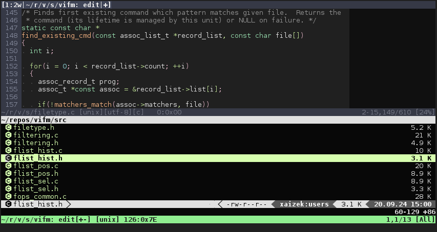

## vifm.vim ##

This is a [Vim][vim]-plugin that provides integration with [Vifm][vifm].

**Note:** it is not self-sufficient and requires the application itself to be
installed to work properly.

### Functionality ###

In addition to integrating Vifm into Vim, it also provides convenience services
to Vifm when it invokes Vim (for `:help` command in particular if you enable
[`'vimhelp'` option][vimhelp]) and makes Vim aware of Vifm-specific filetypes.

#### Vim-user perspective ####

* `:EditVifm`   - select a file or files to open in the current buffer
* `:Vifm`       - alias for `:EditVifm` to be used like `:vert Vifm`
* `:PeditVifm`  - select a file in preview window
* `:SplitVifm`  - split buffer and select a file or files to open
* `:VsplitVifm` - vertically split buffer and select a file or files to open
* `:DiffVifm`   - select a file or files to compare to the current file with
                  `:vert diffsplit`
* `:TabVifm`    - select a file or files to open in tabs
* `:VifmCs`     - attempts to convert Vim's color scheme to Vifm's one

#### Vifm-user perspective ####

* Vim-style help for Vifm
* Handling of rename buffers
* Highlighting of Vifm-specific buffers (rename, external editing, configuration
  files)

### Versioning and compatibility ###

Plugin always tracks the latest development of the application, which for the
most part means documentation updates.

The interface between the plugin and Vifm has changed significantly in v0.8.
Other than that versions don't have to match perfectly for all basic
functionality to work correctly.

### Installation example ###

For a particular combination of [pacman] and [vundle]:

1. Install the application with the following command:
```bash
sudo pacman -S vifm
```
2. Add the following configuration to your `.vimrc`:
```
Plugin 'vifm/vifm.vim'
```
3. Install this plugin with `:PluginInstall`.

Use different commands for other package/plugin managers.

### Screenshot ###



[vim]: https://www.vim.org/
[vifm]: https://vifm.info/
[vimhelp]: https://vifm.info/vimdoc.shtml#vifm-%27vimhelp%27
[pacman]: https://archlinux.org/packages/core/x86_64/pacman/
[vundle]: https://github.com/VundleVim/Vundle.vim
